# PTX Oven Controller - System Design Document

## 1. System Overview

PTX Oven Controller is a commercial oven control system with advanced safety features and high-level automation.

### Key Features
- ✅ Hysteresis temperature control (175°C - 185°C)
- ✅ Multi-layer safety (door, sensor faults, ignition retry)
- ✅ Median filter for sensor noise reduction
- ✅ Ignition safety with retry and lockout
- ✅ Runtime configurable parameters
- ✅ Comprehensive logging

---

## 2. System Architecture


---

## 3. State Machine Diagram

**Note:** This diagram shows the system with **flame detection disabled** (default mode).


---

## 4. Control Flow Diagram


---

## 5. Component Architecture


---

## 6. Sensor Fault Detection Timing


---

## 7. Configuration Parameters

| Parameter | Type | Default | Range | Description |
|-----------|------|---------|-------|-------------|
| temp_target_c | float | 180.0 | 0-300 | Target temperature (°C) |
| temp_delta_c | float | 2.0 | 0.1-50 | Hysteresis half-band (°C) |
| ignition_duration_ms | uint32 | 5000 | 1000-30000 | Igniter ON time (ms) |
| max_ignition_attempts | uint8 | 3 | 1-10 | Max retry before lockout |
| purge_time_ms | uint32 | 2500 | 1000-10000 | Gas purge after fail (ms) |
| flame_detect_temp_rise_c | float | 2.0 | 0-50 | Temp rise for flame detect (°C) |
| sensor_fault_window_ms | uint32 | 1000 | 100-10000 | Fault latch delay (ms) |
| auto_resume_delay_ms | uint32 | 3000 | 1000-30000 | Valid readings before resume (ms) |
| vref_min_v | float | 4.5 | 0-10 | Min vref voltage (V) |
| vref_max_v | float | 5.5 | 0-10 | Max vref voltage (V) |
| periodic_log_ms | uint32 | 1000 | 100-60000 | Log interval (ms) |

---

## 8. Safety Features

### 8.1 Multi-Layer Fault Detection


### 8.2 Ignition Safety Chain

**Current Configuration: Flame Detection = OFF (Default)**

1. **Pre-ignition checks:**
   - ✅ No door open
   - ✅ No sensor faults
   - ✅ System uptime > 2s (sensor stabilized)
   - ✅ Temperature ≤ 175°C

2. **During ignition (5s):**
   - Monitor door state → immediate shutdown if opened
   - Monitor sensor faults → immediate shutdown if detected

3. **Post-ignition:**
   - After 5 seconds → assume ignition successful
   - Igniter turns OFF
   - Continue heating with gas ON
   
**Note:** When `PTX_FLAME_DETECT_ENABLED` is set to 1, the system will check for temperature rise to confirm flame presence and implement retry/purge/lockout logic.

---

## 9. Testing Architecture


### Test Coverage

| Feature | Test Case | Status |
|---------|-----------|--------|
| Door safety | DoorOpenShutdown | ✅ |
| Ignition timing | IgnitionTiming | ✅ |
| Hysteresis control | HysteresisControl | ✅ |
| Sensor fault timing | SensorFaultTimedDetection | ✅ |
| Auto-resume | AutoResumeAfterValidWindow | ✅ |
| Ignition retry | IgnitionRetryAfterFailure | ✅ |
| Ignition lockout | IgnitionLockoutAfterMaxAttempts | ✅ |
| Manual reset | ManualResetFromLockout | ✅ |

---

## 10. Deployment Diagram

```mermaid
graph TB
    subgraph "Arduino MCU"
        APP[sketch.ino<br/>Main Loop]
        
        subgraph "Control Layer"
            CTRL[ptx_oven_control]
            SENS[ptx_sensor_filter]
            ACT[ptx_actuator]
            CFG[ptx_oven_config]
            LOG[ptx_logging]
        end
        
        subgraph "HAL"
            API[api.cpp<br/>Hardware Access]
        end
    end
    
    subgraph "Hardware"
        SENSOR[PT100 Sensor<br/>Analog ADC]
        DOOR[Door Switch<br/>GPIO Interrupt]
        GAS[Gas Valve<br/>GPIO Output]
        IGN[Igniter<br/>GPIO Output]
    end
    
    APP --> CTRL
    CTRL --> SENS
    CTRL --> ACT
    CTRL --> CFG
    CTRL --> LOG
    
    SENS --> API
    ACT --> API
    LOG --> API
    
    API --> SENSOR
    API --> DOOR
    API --> GAS
    API --> IGN
```



---

## 11. Future Enhancements

### Planned Features
- [ ] **PID temperature control** (replace simple hysteresis)
- [ ] **WiFi monitoring** (web dashboard)
- [ ] **Data logging to SD card** (temperature history)
- [ ] **Multiple temperature zones** (top/bottom heating)
- [ ] **Recipe management** (time/temp profiles)
- [ ] **OTA firmware updates**

### Scalability Considerations
- Modular architecture allows easy addition of new sensors
- Runtime config system supports dynamic parameter tuning
- State machine design scales to more complex heating profiles
- HAL abstraction enables porting to different hardware

---

## 12. How to Import to Lucidchart

### Option 1: Manual Recreation
1. Open this document in GitHub (Mermaid renders automatically)
2. Take screenshots of diagrams
3. Import to Lucidchart as image templates
4. Redraw using Lucidchart shapes

### Option 2: PlantUML Export
```bash
# Install PlantUML
npm install -g node-plantuml

# Convert Mermaid to PlantUML (manual conversion needed)
# Then generate PNG:
plantuml system_design.puml
```

### Option 3: Use Mermaid Live Editor
1. Go to https://mermaid.live
2. Copy-paste Mermaid code
3. Export as PNG/SVG
4. Import to Lucidchart

---

## 13. Contact & Maintenance

**Project Repository:** https://github.com/ngvanhak49/ptx_oven_controller_demo

**Documentation Updates:** Keep this file in sync with code changes

**Review Schedule:** Update diagrams after major architectural changes